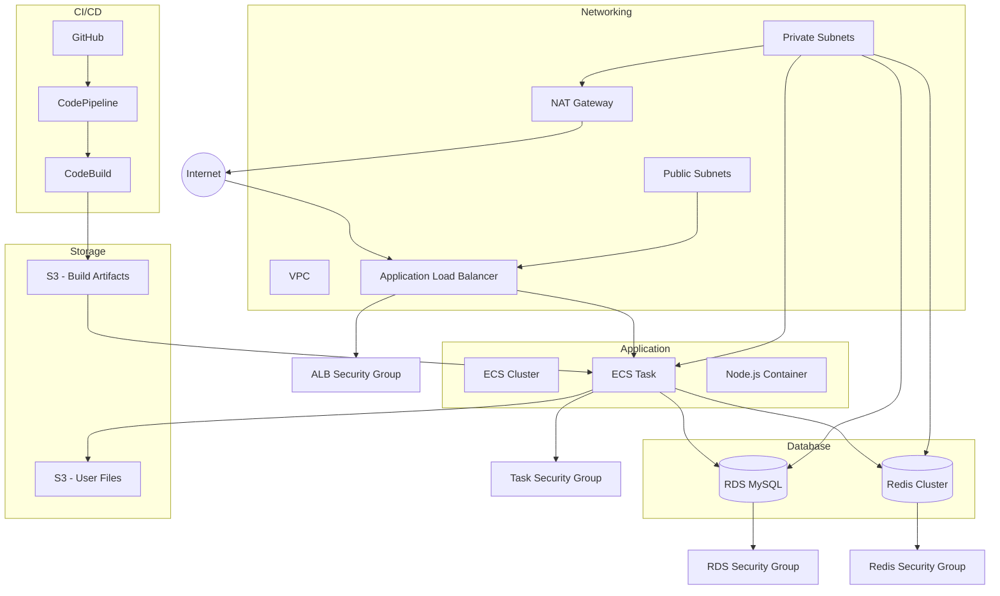

# Welcome to your CDK TypeScript project

This is a blank project for CDK development with TypeScript.

The `cdk.json` file tells the CDK Toolkit how to execute your app.

## Useful commands

* `npm run build`   compile typescript to js
* `npm run watch`   watch for changes and compile
* `npm run test`    perform the jest unit tests
* `npx cdk deploy`  deploy this stack to your default AWS account/region
* `npx cdk diff`    compare deployed stack with current state
* `npx cdk synth`   emits the synthesized CloudFormation template


# WhatToDos API Infrastructure

This repository contains the AWS CDK infrastructure code for the WhatToDos API service. The infrastructure is built using AWS CDK and TypeScript.

## Architecture Overview

The infrastructure consists of several key components:

### Networking Layer
- VPC with public and private subnets across 2 AZs
- NAT Gateway for outbound internet access
- Security Groups for ALB, ECS tasks, RDS, and Redis

### Database Layer
- RDS MySQL instance (t3.micro)
  - Publicly accessible
  - Automated backups enabled
  - Multi-AZ disabled (for cost optimization)
- Redis Cluster (cache.t3.micro)
  - For session management and caching
  - Located in private subnets

### Application Layer
- ECS Cluster with EC2 launch type
- Application Load Balancer (ALB)
  - HTTPS enabled with ACM certificate
  - Health checks configured
- ECS Service
  - Task definition with Node.js container
  - Auto-scaling configured
  - Health check endpoint

### Storage Layer
- S3 Bucket for user files
- S3 Bucket for build artifacts

### CI/CD Pipeline
- CodePipeline for automated deployments
- CodeBuild for building and testing
- GitHub integration for source code
- Automated deployment to ECS

### Monitoring and Logging
- CloudWatch Logs for container logs
- CloudWatch Alarms for monitoring
- X-Ray for tracing (optional)

## Infrastructure Diagram



## Prerequisites

- AWS CLI configured with appropriate credentials
- Node.js 20.x or later
- AWS CDK installed globally
- TypeScript 4.x or later

## Environment Variables

Required environment variables:
```bash
AWS_ACCESS_KEY_ID=your_access_key
AWS_SECRET_ACCESS_KEY=your_secret_key
AWS_REGION=your_region
GITHUB_TOKEN=your_github_token
```

## Deployment

1. Install dependencies:
```bash
npm install
```

2. Bootstrap CDK (first time only):
```bash
cdk bootstrap
```

3. Deploy the stack:
```bash
cdk deploy --all
```

## Cost Optimization

- Using t3.micro instances for RDS and Redis
- Single NAT Gateway
- Multi-AZ disabled for RDS
- Auto-scaling configured for cost efficiency

## Security

- All sensitive data stored in AWS Secrets Manager
- HTTPS enabled for all external communications
- Security groups restrict access to necessary ports only
- IAM roles follow principle of least privilege

## Monitoring

- CloudWatch Logs for container logs
- CloudWatch Alarms for:
  - CPU utilization
  - Memory utilization
  - Disk space
  - Error rates

## Backup and Recovery

- RDS automated backups enabled
- S3 versioning enabled for user files
- ECS task definitions versioned

## Maintenance

- Regular security updates
- Database maintenance windows configured
- Automated backups
- Log rotation configured

## Troubleshooting

Common issues and solutions:
1. Database connection issues
   - Check security group rules
   - Verify database credentials
   - Check VPC connectivity

2. Container startup issues
   - Check CloudWatch logs
   - Verify environment variables
   - Check task definition

3. Deployment failures
   - Check CodeBuild logs
   - Verify GitHub token
   - Check IAM permissions

## Contributing

1. Fork the repository
2. Create a feature branch
3. Commit your changes
4. Push to the branch
5. Create a Pull Request

## License

This project is licensed under the MIT License - see the LICENSE file for details.